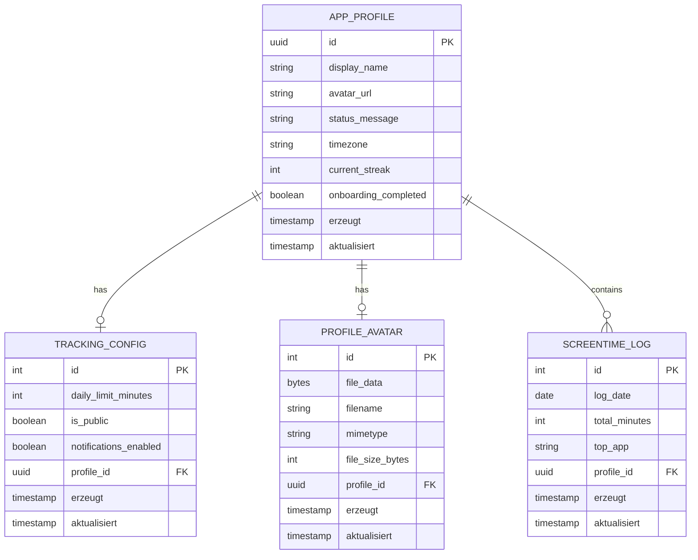

# TimeTether Backend

TimeTether ist ein Backend-Service fuer eine geraeteuebergreifende Screen-Time-Tracking-App.
Die Kernidee ist es, nicht nur die eigene Bildschirmzeit zu erfassen, sondern diese Daten
(kontrolliert) mit Freunden zu teilen, um sich gegenseitig bei der Reduzierung der Handy-Nutzung
zu unterstuetzen.

Dieses Repository bildet das fundamentale Backend und wurde initial als Modulprojekt im
Sommersemester 2026 in Karlsruhe gestartet. Es ist so konzipiert, dass es nahtlos von einem
akademischen MVP (Minimum Viable Product) zu einer vollwertigen Startup-Anwendung skaliert
werden kann.

## Aktuelles ER-Diagramm

Quelle: aktuelles Prisma-Schema in prisma/schema.prisma.

## Entitäten und Regeln

- AppProfile ist die zentrale Entitaet fuer Benutzerprofil und Basisstatus.
- TrackingConfig ist 1:1 optional zu AppProfile (per unique profile_id).
- ProfileAvatar ist 1:1 optional zu AppProfile (per unique profile_id).
- ScreentimeLog ist 1:n zu AppProfile.
- Fuer ScreentimeLog gilt zusaetzlich ein Unique-Constraint auf (profile_id, log_date).

## Zukünftige Roadmap

- Social Accountability: Implementierung einer Friendship-Entitaet (m:n) fuer gegenseitige Kontrolle.
- Multi-Device Support: Hinzufuegen einer Device-Entitaet, um Zeiten von iPad, iPhone und Mac zu differenzieren und zusammenzufuehren.
- Notifications: Serverseitige Push-Benachrichtigungen, wenn Freunde ihre Limits ueberschreiten.
